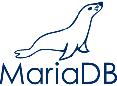

<!--
**kerim086/kerim086** is a ✨ _special_ ✨ repository because its `README.md` (this file) appears on your GitHub profile.

Here are some ideas to get you started:

- 🔭 I’m currently working on ...
- 🌱 I’m currently learning ...
- 👯 I’m looking to collaborate on ...
- 🤔 I’m looking for help with ...
- 💬 Ask me about ...
- 📫 How to reach me: ...
- 😄 Pronouns: ...
- ⚡ Fun fact: ...
-->

# Hi, I’m Kerim — a Full‑Stack Developer 👋

## 🤖 Tech stack

| Category | Tech |
|---|---|
| 🧱 Programming languages |     |
| 🌐 Web development |   |
| 💾 Databases |    |

## 🌱 Currently learning
- Python

## 💬 About me
- 🔭 **Currently working on:** Detecto and Snap2Label
- 😁 I enjoy working on projects where I can contribute to both the frontend (design, UI/UX, etc.) and the backend (APIs, databases, etc.).
- 🗣️ I speak German, Russian, and English.
- ⚡ **Fun fact:** I like eating very spicy food.