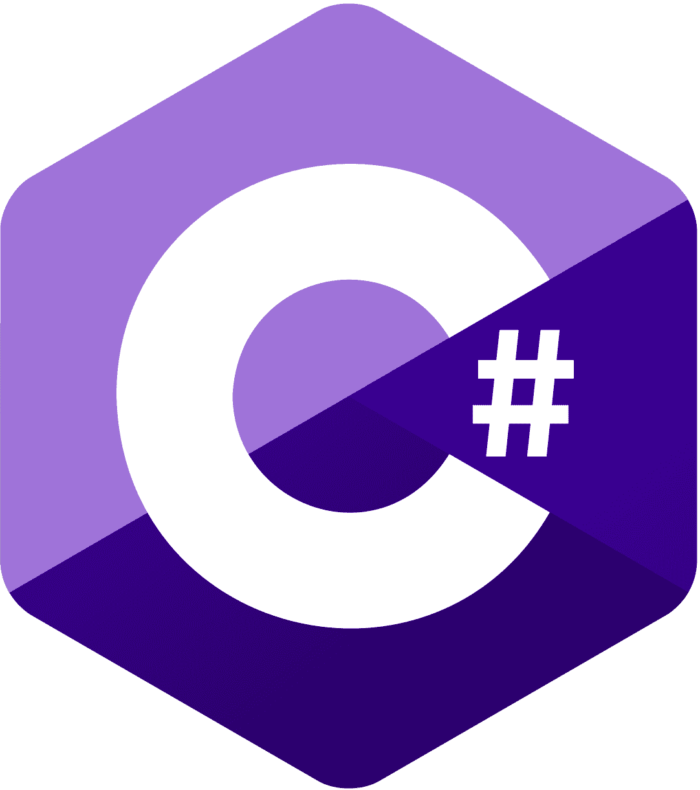
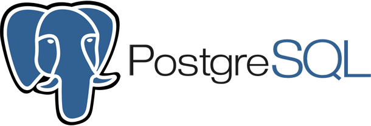

<!--
**kerim086/kerim086** is a ✨ _special_ ✨ repository because its `README.md` (this file) appears on your GitHub profile.

Here are some ideas to get you started:

- 🔭 I’m currently working on ...
- 🌱 I’m currently learning ...
- 👯 I’m looking to collaborate on ...
- 🤔 I’m looking for help with ...
- 💬 Ask me about ...
- 📫 How to reach me: ...
- 😄 Pronouns: ...
- ⚡ Fun fact: ...
-->

# Hi, I’m Kerim — a Full‑Stack Developer 👋

## 💬 About me
- 🔭 **Currently working on:** Detecto and Snap2Label
- 😁 I enjoy working on projects where I can contribute to both the frontend (design, UI/UX, etc.) and the backend (APIs, databases, etc.).
- 🗣️ I speak German, Russian, and English.
- ⚡ **Fun fact:** I like eating very spicy food.

## 🌱 Currently learning
- Python
- Training computer vision models locally (e.g., YOLO for object detection)

## 🤖 Tech stack
<table align="center">
  <tr>
    <th colspan="5" align="center"><h3 align="center">🧰 Skills</h3></th>
  </tr>

  <tr>
    <td><strong>🧱 Programming Languages</strong></td>
    <td></td>
    <td></td>
    <td></td>
    <td></td>
  </tr>

  <tr>
    <td><strong>🌐 Web Development</strong></td>
    <td></td>
    <td></td>
    <td></td>
    <td></td>
  </tr>

  <tr>
    <td><strong>💾 Databases</strong></td>
    <td></td>
    <td></td>
    <td></td>
    <td></td>
  </tr>
</table>